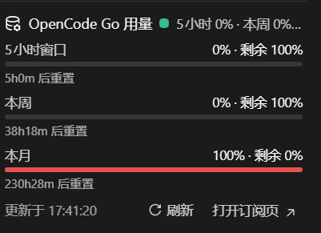

# dsh-opencode-go-usage-sidebar

An **in-tree** DeepSeek Harness customization that adds an **OpenCode Go 用量 panel below the sidebar session list** (the `sidebar.workspaces.footer` strip). It restores and 0.1.3-adapts the local *opencode usage panel* the author used before upgrading to `0.1.3-alpha.1`.

> This is a **patch repository**, not a standalone installable plugin: it modifies DSH core (`packages/client/ui-workspace` adds a new sidebar footer slot, and `packages/bundle/web-app` mounts two rows). For a standalone, installable floating widget see the sibling repo [mouseteamlucky/dsh-opencode-go-usage](https://github.com/mouseteamlucky/dsh-opencode-go-usage).

## What it adds

- `packages/client/ui-usage` — browser panel (three vertical quota meters) registered on `sidebar.workspaces.footer`.
- `packages/host/opencode-usage` — same-origin bridge route `/api/opencode-go/usage` (OpenCode Go bearer token stays host-side).
- `packages/client/ui-workspace` — re-declares the `sidebar.workspaces.footer` list slot and renders the strip below the session list.
- `packages/bundle/web-app` — `cordis.patch.yml` rows + package dependencies.
- root `tsconfig.base/client/host` wiring.

## Apply to a 0.1.3-alpha.1 checkout

```bash
# 1) apply the patch
git am 0001-fix-restore-opencode-go-usage-widget-0.1.3-adapt.patch
#    (or: git apply 0001-fix-restore-opencode-go-usage-widget-0.1.3-adapt.patch)

# 2) install workspace deps
pnpm install

# 3) build the two new packages + the modified ui-workspace client bundle
./node_modules/.bin/tsc -b packages/client/ui-usage
./node_modules/.bin/tsc -b packages/host/opencode-usage
pnpm --filter @deepseek-ai/dsh-client-ui-usage run bundle
pnpm --filter @deepseek-ai/dsh-client-ui-workspace run bundle
cd packages/host/opencode-usage && pnpm exec tsdown && cd - >/dev/null

# 4) restart DSH (launcher / restart-guarded) and hard-refresh the browser (Ctrl+F5)
```

## Verification

See [VERIFICATION.zh.md](VERIFICATION.zh.md) — static/preset/real-turn checks all green, and a headless-browser probe confirms the panel renders (`OpenCode Go 用量` with rolling/weekly/monthly meters).

## Screenshot



## License

MIT. See [LICENSE](LICENSE).
